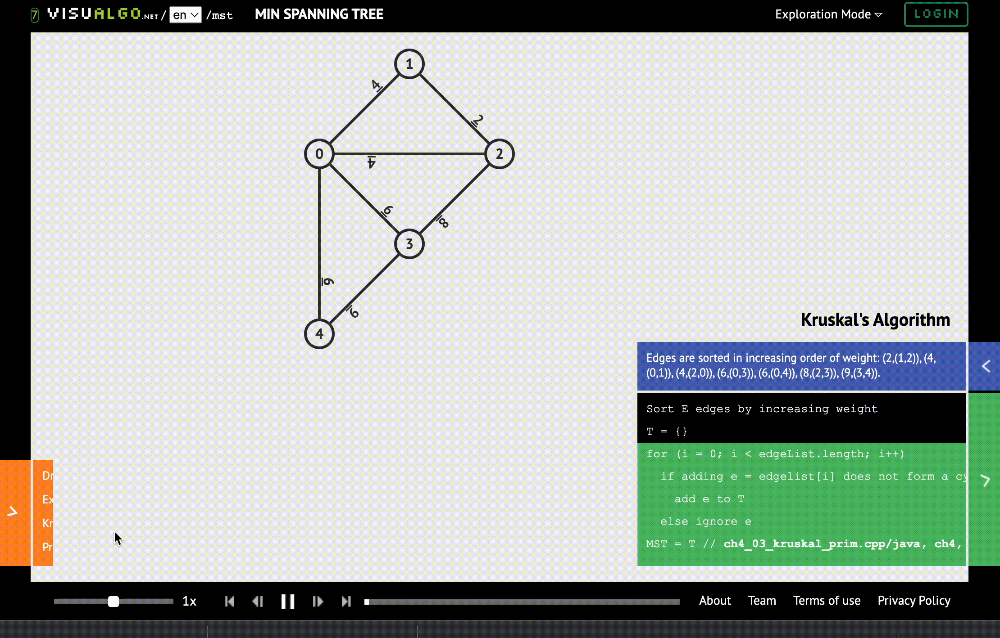

# GRAPHS

## Types of Graph Data Structures

1. Adjacency Matrix
2. Adjacency List
3. Incidence Matrix
4. Incidence List
5. Weighted Graph
6. Unweighted Graph
7. Directed Graph
8. Undirected Graph
9. Cyclic Graph
10. Acyclic Graph
11. Connected Graph
12. Disconnected Graph
13. Tree

A Graph is a non-linear data structure consisting of nodes and edges. The nodes are sometimes also referred to as vertices and the edges are lines or arcs that connect any two nodes in the graph. In this article, we will understand the difference between the ways of representation of the graph. 

<h1>Adjacency Matrix Vs Adjacency List</h1>

A graph can be represented in mainly two ways. They are: 
 
1. Adjacency Matrix is a 2D array of size V x V where V is the number of vertices in a graph. 
    Let the 2D array be adj[][], a slot adj[i][j] = 1 indicates that there is an edge from vertex i to vertex j. Adjacency matrix for undirected graph is always symmetric. Adjacency Matrix is also used to represent weighted graphs. If adj[i][j] = w, then there is an edge from vertex i to vertex j with weight w.

2. Adjacency List: An Adjacency list is an array consisting of the address of all the linked lists. 
    The first node of the linked list represents the vertex and the remaining lists connected to this node represents the vertices to which this node is connected. This representation can also be used to represent a weighted graph. The linked list can slightly be changed to even store the weight of the edge.

----------------------------------------------------------------------------------------------------------------------------------------------------------------------------------------------

Let us consider a graph to understand the adjacency list and adjacency matrix representation. Let the undirected graph be: 

Shown in: 

Adjacency Matrix: In the adjacency matrix representation, a graph is represented in the form of a two-dimensional array. The size of the array is V x V, where V is the set of vertices. The following image represents the adjacency matrix representation: 
 

let myAdjMatrix = [  
    [0, 1, 0, 0, 1],  
    [1, 0, 1, 0, 0],  
    [0, 1, 0, 1, 0],  
    [0, 0, 1, 0, 1],  
    [1, 0, 0, 1, 0]  
]  

Adjacency List: In the adjacency list representation, a graph is represented as an array of linked list. The index of the array represents a vertex and each element in its linked list represents the  vertices that form an edge with the vertex. The following image represents the adjacency list representation:

// write myAdjMatrix as an adjacency list

let myAdjList = [  
    [1, 4],  
    [0, 2],  
    [1, 3],  
    [2, 4],  
    [0, 3]  
]  

<table>
<tr>
<td>Adjacency Matrix: In the adjacency matrix representation, a graph is represented in the form of a two-dimensional array. The size of the array is V x V, where V is the set of vertices. The following image represents the adjacency matrix representation: </td>
<td>  </td>
<td>  </td>
</tr>
<tr>
<tr>
<td>Adjacency List: In the adjacency list representation, a graph is represented as an array of linked list. The index of the array represents a vertex and each element in its linked list represents the  vertices that form an edge with the vertex. The following image represents the adjacency list representation:</td>
<td>  </td>
</tr>
</table>

